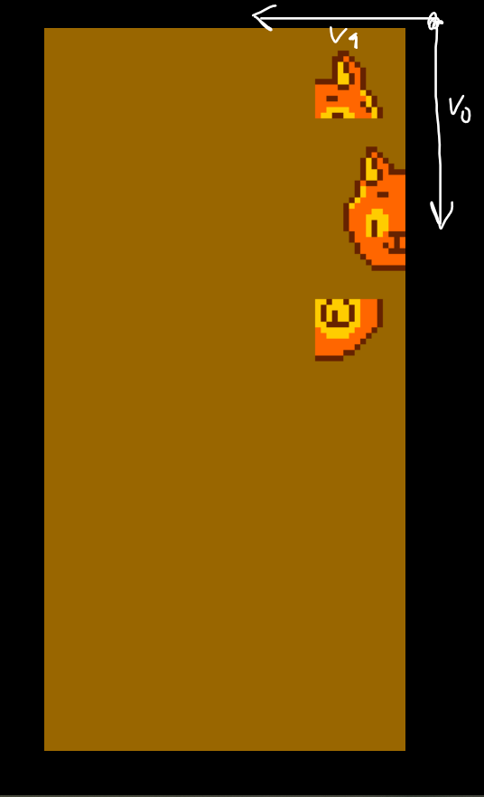

# Four Corners

A game made for [OctoJam 7](https://itch.io/jam/octojam-7) / [Finish Your Game Jam](https://itch.io/jam/finishyourgamejam2020) done in CHIP 8 and inspired by Tamagotchi and the child's game of the same name.

Developed using [Octo](https://github.com/JohnEarnest/Octo).

    

## How to play

In each turn, a random character will be chosen. You have to click on it in time, or else you'll lose. The challenge is to stay the most time possible alive.

## Game Logs

 &nbsp;|             |  &nbsp;
:-------------------------|:-------------------------:|:-------------------------:
**11/11/2020** | Jamming [soundtrack](https://www.youtube.com/watch?v=HL9_xm5HwrE&t=1649s)! 🶠Sprites! 🨠Brainstorming! :: Game Concept = Tamagotchi + Four Corners mini-game |  
**15/11/2020** | Sprites! 🨠Render character sprites and background in Octo. Getting started on some input programming 💻 | 
**28/01/2021** | "He move. But he no jumpy." | 
**13/07/2021** | Bugs! | 
**29/07/2021** | Splash screen! ✨ | 
**04/08/2021** | Building the cutting (corners) mechanic... ✂ | 
**24/08/2021** | Instructions splash screen! 👩‍🏫 *taking a break from actually coding mechanics e-e* | 
**08/10/2021** | Character select screen! 🱠| 

## Resources

- Pixel Text Writer Tool - [EZ Writer](http://beyondloom.com/tools/ezwriter.html)
- Pixel Sprite Creation Tool - [Piskel](https://www.piskelapp.com/)
